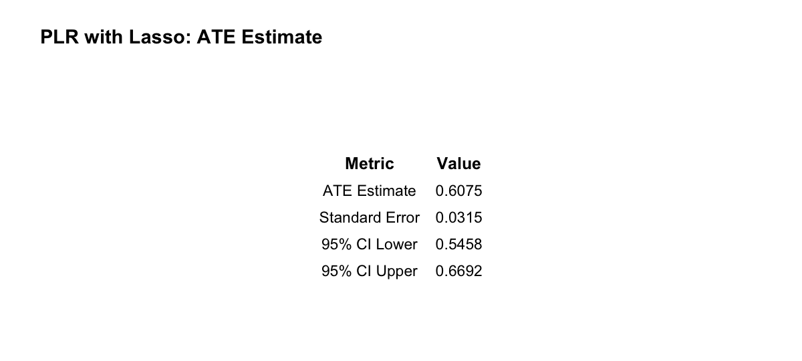
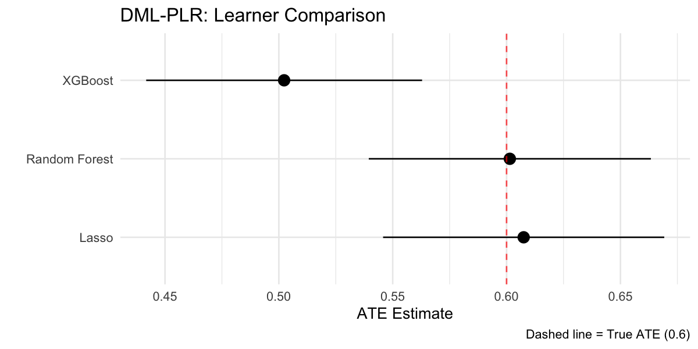
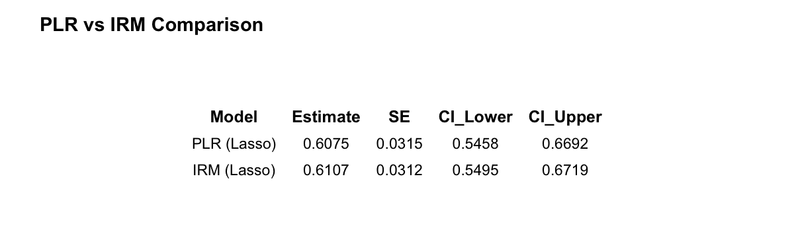
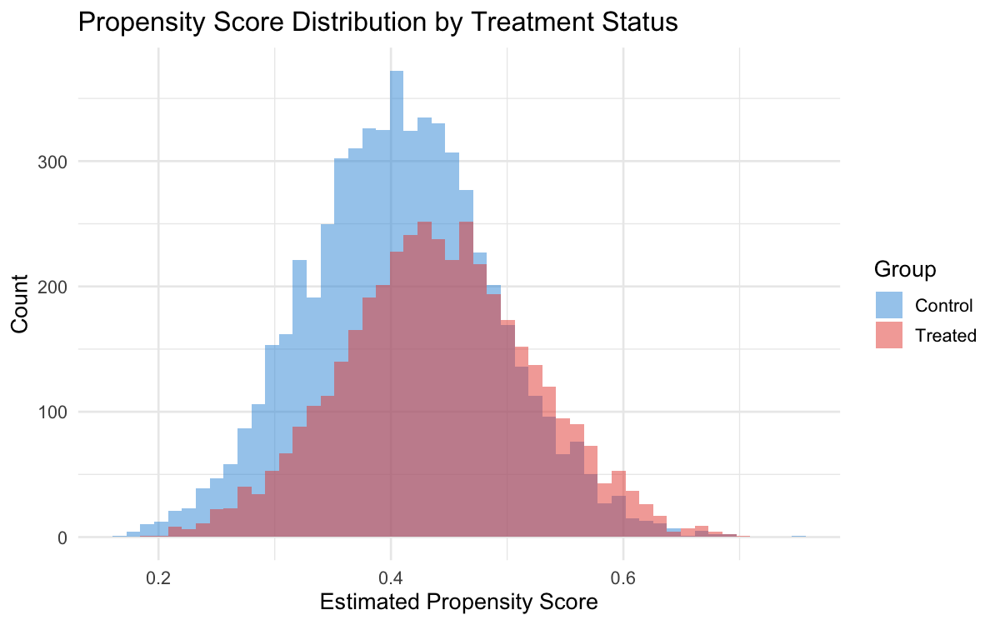
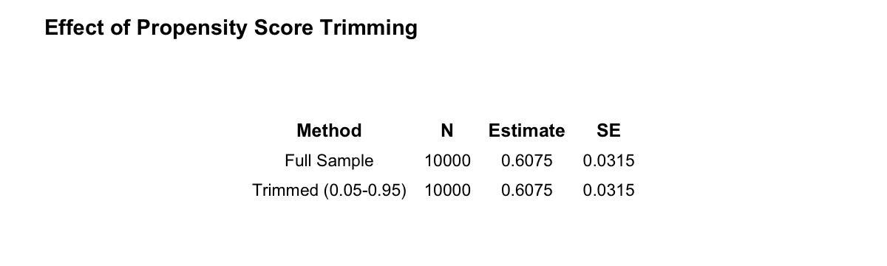
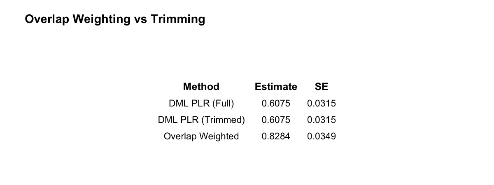
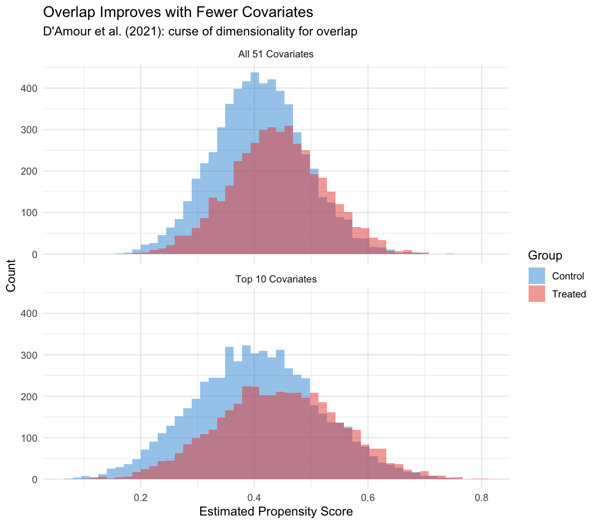
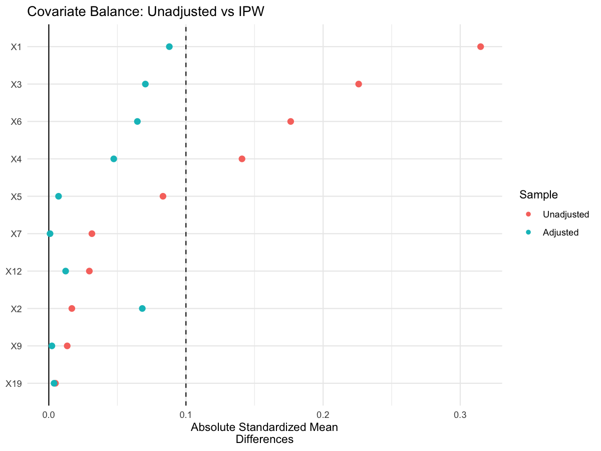
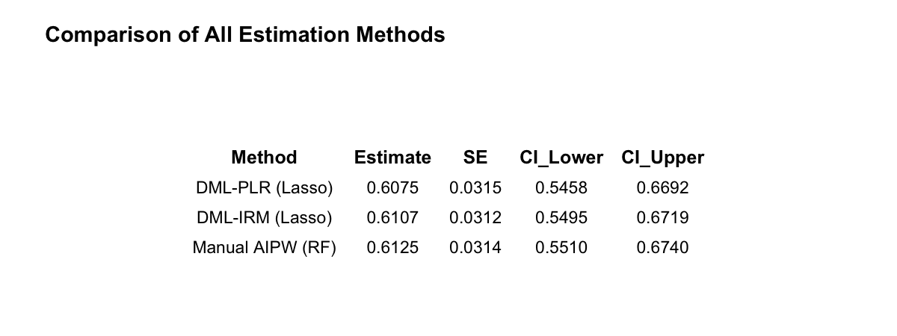

::: {.callout-important}
## Accept the Assignment

**[Click here to accept Problem Set 2 on GitHub Classroom](PLACEHOLDER_URL)**

This will create your personal repository for this problem set.
:::

## Introduction

The State Health Department has contracted you to evaluate the impact of **Medicaid expansion** on hospital utilization. The policy was implemented in 2020, and you have access to rich administrative claims data from 2019-2021 with 50+ potential confounders.

### The Situation

Dr. P-Hacker's initial analysis simply regressed hospital visits on Medicaid expansion status, controlling for age and gender:

> "The coefficient on Medicaid is 0.8 additional visits per year (p < 0.001). Expansion clearly increases utilization!"

Dr. Doub R. Obust, the department's methodologist, raises concerns:

1. With 50+ confounders, traditional regression may overfit or suffer from model misspecification
2. The treatment-outcome relationship may not be linear
3. Standard errors assume correct model specification
4. We need **doubly-robust** estimation that remains valid even if one of two models (propensity or outcome) is wrong

Your task is to implement Double Machine Learning (DML) using the `DoubleML` package, compare nuisance learners, diagnose overlap violations, and provide robust policy conclusions.

### Study Parameters

| Parameter | Value |
|-----------|-------|
| Sample size | 10,000 individuals |
| Treatment | Medicaid enrollment (binary) |
| Outcome | Hospital visits in 2021 (count) |
| Confounders | 50 variables (demographics, health status, SES) |
| Pre-treatment outcome | Hospital visits in 2019 |
| Treatment rate | ~35% enrolled in Medicaid |

### Data

Load the provided dataset:

```{r}
#| label: load-data
#| eval: true

# Load the Medicaid expansion data
medicaid_data <- read.csv("data/ps-2-medicaid.csv")
```

The dataset contains:

- `Y`: Hospital visits in 2021 (outcome)
- `D`: Medicaid enrollment (treatment, 1 = enrolled)
- `Y_pre`: Hospital visits in 2019 (pre-treatment outcome)
- `X1`-`X50`: Confounders (demographics, health conditions, SES indicators)

::: {.callout-note}
## Code Companion Available

A **Code Companion** file (`ps-2-code-companion.qmd`) is provided alongside
this problem set. It contains reusable code patterns for all the methods
used in this assignment, demonstrated on a different dataset. Use it as a
reference — you'll need to adapt the patterns to fit this problem set's data
and questions.

**If you get stuck on a computational task for more than 45 minutes:**
look for the progressive hints embedded in each task (collapsed callouts below).

**Submission:** Source `.qmd` file is required. Rendered HTML is appreciated
but not required — unrendered `.qmd` is accepted.
:::

---

## Task 1: Conceptual Foundation (20 points)

*No code required for this task. Write clear, technical explanations.*

### 1.1 The Problem with Naive ML (8 points)

a) **Regularization bias:** Explain why using a machine learning model (like Lasso) to directly predict $Y$ from $(D, X)$ and extracting the coefficient on $D$ produces biased treatment effect estimates. What is the source of this bias?

b) **Overfitting bias:** Why does using the same data to fit the ML model and estimate the treatment effect lead to overfitting bias? How does this affect inference (confidence intervals, p-values)?

### 1.2 The DML Solution (8 points)

c) **Neyman orthogonality:** Explain the concept of Neyman orthogonality. Why does the partially linear model's orthogonal score function $\psi(W; \tau, \eta) = (Y - \ell(X) - \tau(D - m(X)))(D - m(X))$ satisfy this condition?

d) **Cross-fitting:** Describe the cross-fitting procedure. Why is sample splitting necessary, and why do we use K-fold cross-fitting rather than a single sample split?

### 1.3 Double Robustness (4 points)

e) **AIPW property:** The Augmented Inverse Probability Weighting (AIPW) estimator is "doubly robust." Explain what this means in terms of which models can be misspecified while still obtaining consistent estimates.

---

## Task 2: DML Implementation (30 points)

Implement Double Machine Learning using the `DoubleML` package in R.

**Packages:** `DoubleML`, `mlr3`, `mlr3learners`, `data.table`

### 2.1 Partially Linear Model with Lasso (10 points)

Estimate the Average Treatment Effect (ATE) using DML with:

- Partially Linear Model (PLM) specification
- Lasso (glmnet) for both nuisance functions ($\ell(X)$ and $m(X)$)
- 5-fold cross-fitting
- Partialling-out score

Report:
- Point estimate of ATE
- 95% confidence interval
- Standard error

::: {.callout-tip collapse="true"}
## Hint: Getting Started (Tier 1)

Use `DoubleMLPLR$new()` with `lrn("regr.cv_glmnet")` for both nuisance models.
See Code Companion section **"Fitting a PLR Model"** for the full pattern.
:::

::: {.callout-tip collapse="true"}
## Code Skeleton (Tier 2)

*Show your attempt first — what did you try, and what error did you get?*

```r
dml_data <- DoubleMLData$new(
  data = as.data.table(___),
  y_col = "___",
  d_cols = "___",
  x_cols = c(paste0("X", 1:50), "Y_pre")
)

ml_l <- lrn("regr.cv_glmnet")
ml_m <- lrn("regr.cv_glmnet")

set.seed(883)
dml_plr <- DoubleMLPLR$new(dml_data, ml_l, ml_m, n_folds = ___)
dml_plr$___()
dml_plr$summary()
```
:::

::: {.callout-caution collapse="true"}
## Expected Output (Tier 3)

If you cannot get the code to run, reference this pre-rendered output and proceed to the interpretation.


:::

### 2.2 Learner Comparison (10 points)

Compare three different ML learners for the nuisance functions:

1. **Lasso** (`regr.cv_glmnet` / `classif.cv_glmnet`)
2. **Random Forest** (`regr.ranger` / `classif.ranger`)
3. **Gradient Boosting** (`regr.xgboost` / `classif.xgboost`)

For each learner combination:
- Estimate the ATE using DML-PLM
- Report point estimates and 95% CIs
- Create a forest plot visualization comparing the estimates

**Question:** How sensitive are your results to the choice of nuisance learner? What does this tell you about the data generating process?

::: {.callout-tip collapse="true"}
## Hint: Learner Comparison (Tier 1)

Loop over three learner pairs (Lasso, RF, XGBoost), fit each with `DoubleMLPLR$new()`,
extract `$coef` and `$confint()`, then combine into a data frame for plotting.
See Code Companion section **"Comparing ML Learners"** and **"Creating a Forest Plot"**.
:::

::: {.callout-tip collapse="true"}
## Code Skeleton (Tier 2)

*Show your attempt first — what did you try, and what error did you get?*

```r
learner_pairs <- list(
  Lasso = list(ml_l = lrn("regr.cv_glmnet"), ml_m = lrn("regr.cv_glmnet")),
  RF    = list(ml_l = lrn("regr.ranger", num.trees = 500),
               ml_m = lrn("regr.ranger", num.trees = 500)),
  XGB   = list(ml_l = lrn("regr.xgboost", nrounds = 100, verbose = 0),
               ml_m = lrn("regr.xgboost", nrounds = 100, verbose = 0))
)

results <- lapply(names(learner_pairs), function(name) {
  set.seed(883)
  obj <- DoubleMLPLR$new(dml_data, ___, ___, n_folds = 5)
  obj$fit()
  ci <- obj$confint()
  data.frame(Learner = name, Estimate = as.numeric(obj$coef),
             CI_Lower = ci[1,1], CI_Upper = ci[1,2])
})

comparison <- do.call(rbind, results)
# Then use ggplot + geom_pointrange for the forest plot
```
:::

::: {.callout-caution collapse="true"}
## Expected Output (Tier 3)

If you cannot get the code to run, reference this pre-rendered output and proceed to the interpretation.


:::

### 2.3 Interactive Regression Model (10 points)

Now estimate the ATE using the **Interactive Regression Model (IRM)**, which allows for treatment effect heterogeneity:

$$Y = g_0(D, X) + U, \quad E[U|X,D] = 0$$
$$D = m_0(X) + V, \quad E[V|X] = 0$$

Compare the IRM estimate to the PLM estimate. Do they differ substantially? What might explain any differences?

::: {.callout-tip collapse="true"}
## Hint: IRM Setup (Tier 1)

Use `DoubleMLIRM$new()` with a **classification** learner for the treatment model.
The key change from PLR: `lrn("classif.cv_glmnet", predict_type = "prob")`.
See Code Companion section **"Fitting an IRM Model"**.
:::

::: {.callout-tip collapse="true"}
## Code Skeleton (Tier 2)

*Show your attempt first — what did you try, and what error did you get?*

```r
ml_g <- lrn("regr.cv_glmnet")          # outcome model (regression)
ml_m <- lrn("classif.cv_glmnet",        # treatment model (classification!)
             predict_type = "prob")      # must return probabilities

set.seed(883)
dml_irm <- DoubleMLIRM$new(dml_data, ml_g, ml_m, n_folds = 5, score = "ATE")
dml_irm$fit()
dml_irm$summary()
```
:::

::: {.callout-caution collapse="true"}
## Expected Output (Tier 3)

If you cannot get the code to run, reference this pre-rendered output and proceed to the interpretation.


:::

---

## Task 3: Diagnostics (20 points)

### 3.1 Propensity Score Overlap (15 points)

Examine the propensity scores from your best-performing nuisance learner:

a) **Histogram:** Create overlapping histograms of predicted propensity scores by treatment status. Are there regions of poor overlap?

::: {.callout-caution collapse="true"}
## Expected Output: 3.1a (Tier 3)


:::

b) **Trimming:** Apply propensity score trimming (e.g., drop observations with $\hat{e}(X) < 0.05$ or $\hat{e}(X) > 0.95$). How many observations are dropped? How does the ATE estimate change?

::: {.callout-caution collapse="true"}
## Expected Output: 3.1b (Tier 3)


:::

c) **Overlap weighting:** As an alternative to trimming, implement overlap weighting (weights = $\hat{e}(X)(1-\hat{e}(X))$). Compare to the trimmed estimate.

::: {.callout-caution collapse="true"}
## Expected Output: 3.1c (Tier 3)


:::

d) **Dimensionality and overlap (D'Amour et al. 2021):** Re-run your propensity score estimation using only the 10 most important covariates (based on variable importance from your best learner). Compare the propensity score distributions to those using all 50 covariates. Does the overlap improve? Relate your findings to D'Amour et al.'s theoretical result about the curse of dimensionality for overlap.

::: {.callout-tip collapse="true"}
## Hint: Extracting Variable Importance (Tier 1)

Fit a `ranger` model with `importance = "impurity"`, then use
`sort(fit$variable.importance, decreasing = TRUE)` to rank covariates.
See Code Companion section **"Extracting Propensity Scores"**.
:::

::: {.callout-caution collapse="true"}
## Expected Output: 3.1d (Tier 3)


:::

### 3.2 Covariate Balance (10 points)

Using the `cobalt` package, assess covariate balance:

a) **Unweighted balance:** Create a Love plot showing standardized mean differences before any adjustment.

b) **IPW balance:** Create a Love plot after inverse probability weighting. Which covariates remain imbalanced?

c) **Balance table:** Report a balance table with means, standardized differences, and variance ratios for the 10 most important covariates.

::: {.callout-tip collapse="true"}
## Hint: cobalt Package (Tier 1)

Use `love.plot()` with `un = TRUE` to show before/after in one plot.
See Code Companion section **"Covariate Balance with cobalt"**.
:::

::: {.callout-caution collapse="true"}
## Expected Output: 3.2 (Tier 3)


:::

---

## Task 4: AIPW Implementation (15 points)

### 4.1 Manual AIPW (10 points)

Implement the AIPW estimator **manually** (without using DoubleML's built-in AIPW):

$$\hat{\tau}_{AIPW} = \frac{1}{n}\sum_{i=1}^{n} \left[ \hat{\mu}_1(X_i) - \hat{\mu}_0(X_i) + \frac{D_i(Y_i - \hat{\mu}_1(X_i))}{\hat{e}(X_i)} - \frac{(1-D_i)(Y_i - \hat{\mu}_0(X_i))}{1-\hat{e}(X_i)} \right]$$

Where:
- $\hat{\mu}_1(X)$ = predicted outcome under treatment
- $\hat{\mu}_0(X)$ = predicted outcome under control
- $\hat{e}(X)$ = predicted propensity score

Use cross-fitting for all nuisance estimates. Report the AIPW estimate and standard error (using influence function variance).

::: {.callout-tip collapse="true"}
## Hint: AIPW Structure (Tier 1)

Break into 3 steps: (1) predict outcomes by treatment status ($\hat{\mu}_1$, $\hat{\mu}_0$),
(2) predict propensity scores ($\hat{e}$), (3) plug into AIPW formula.
Use a K-fold loop where you train on K-1 folds and predict on the held-out fold.
See Code Companion section **"Manual AIPW Estimator"**.
:::

::: {.callout-tip collapse="true"}
## Code Skeleton (Tier 2)

*Show your attempt first — what did you try, and what error did you get?*

```r
K <- 5
folds <- sample(rep(1:K, length.out = nrow(medicaid_data)))
mu1_hat <- mu0_hat <- e_hat <- numeric(nrow(medicaid_data))

for (k in 1:K) {
  train <- which(folds != k)
  test  <- which(folds == k)

  # Fit outcome model on treated obs in training fold
  # Fit outcome model on control obs in training fold
  # Fit propensity model on all training obs
  # Predict on test fold
}

# Clip e_hat to avoid division by zero
e_hat <- pmax(0.01, pmin(0.99, e_hat))

# AIPW influence function
psi <- mu1_hat - mu0_hat +
  D * (Y - mu1_hat) / e_hat -
  (1 - D) * (Y - mu0_hat) / (1 - e_hat)

tau_aipw <- mean(psi)
se_aipw  <- sd(psi) / sqrt(length(psi))
```
:::

::: {.callout-caution collapse="true"}
## Expected Output: Task 4 (Tier 3)

If you cannot get the code to run, reference this pre-rendered output and proceed to the comparison.


:::

### 4.2 Comparison (5 points)

Compare your manual AIPW estimate to:
- The DoubleML PLM estimate
- The DoubleML IRM estimate

Do they agree? Explain any discrepancies.

---

## Task 5: Policy Memo (15 points)

Write a 400-500 word policy memo for the State Health Department Commissioner. Your memo should:

1. **State the research question** clearly for a policy audience

2. **Present the main finding** with appropriate uncertainty quantification:
   - What is the estimated effect of Medicaid expansion on hospital utilization?
   - How confident should the Commissioner be in this estimate?

3. **Address robustness:**
   - How sensitive are results to analytical choices?
   - What are the key assumptions, and how plausible are they?

4. **Provide policy implications:**
   - What does this mean for the department's planning?
   - What additional analyses or data would strengthen conclusions?

Use appropriate language for a government policy audience. Avoid technical jargon. Focus on decisions and implications.

---

## Submission Requirements

Push to your GitHub Classroom repository by **March 13, 2026 at 11:59 PM**:

1. **Source .qmd file** (required)
2. **Rendered HTML** of your completed .qmd file (if possible — unrendered `.qmd` accepted)

Your submission should include:

- All code with `eval: true` so results are visible (if rendering)
- Clear written answers to conceptual questions
- Well-formatted tables and visualizations
- The policy memo as a separate section

::: {.callout-note}
## If Using Fallback Outputs

If you used any Tier 3 fallback outputs, include in your submission:

- Your attempted code (even if it didn't run)
- The error message you encountered
- A brief explanation of what you think went wrong
:::


---

## Evaluation Criteria

| Component | Points | Criteria |
|-----------|--------|----------|
| Task 1: Conceptual | 20 | Accurate explanations of DML theory |
| Task 2: Implementation | 30 | Correct DML implementation, learner comparison |
| Task 3: Diagnostics | 25 | Proper overlap and balance assessment |
| Task 4: AIPW | 15 | Correct manual implementation |
| Task 5: Communication | 15 | Clear, policy-appropriate, actionable |

---

## Hints

- Start with the [DoubleML Getting Started](https://docs.doubleml.org/stable/guide/basics.html) vignette
- Use `mlr3::lrn()` to create learners; `mlr3learners` provides Lasso, RF, XGBoost
- For propensity scores, remember to specify `classif.` learners for the treatment model
- The `cobalt` package's `bal.tab()` and `love.plot()` functions are useful for balance diagnostics
- For influence function variance of AIPW, the variance is $\frac{1}{n} Var(\hat{\psi}_i)$ where $\hat{\psi}_i$ is the individual-level influence function value

---

## Key Formulas

**Partially Linear Model (PLM):**
$$Y = D\tau + g_0(X) + U, \quad E[U|D,X] = 0$$
$$D = m_0(X) + V, \quad E[V|X] = 0$$

**DML Orthogonal Score (Partialling Out):**
$$\psi(W; \tau, \eta) = (Y - \ell_0(X) - \tau(D - m_0(X)))(D - m_0(X))$$

**AIPW Estimator:**
$$\hat{\tau}_{AIPW} = \frac{1}{n}\sum_{i=1}^{n} \left[ \hat{\mu}_1(X_i) - \hat{\mu}_0(X_i) + \frac{D_i(Y_i - \hat{\mu}_1(X_i))}{\hat{e}(X_i)} - \frac{(1-D_i)(Y_i - \hat{\mu}_0(X_i))}{1-\hat{e}(X_i)} \right]$$
